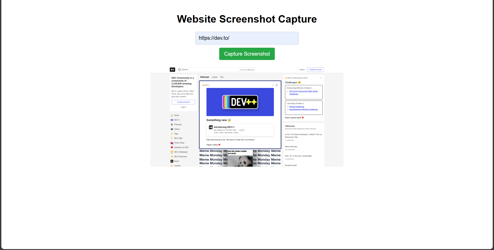

# Website Screenshot Capture

This is a simple web application that allows users to capture screenshots of any website by entering its URL. The app uses the [ScreenshotAPI](https://screenshotapi.net/) to generate and display the screenshot. The app is built using HTML, CSS, and JavaScript.

## Table of Contents

- [Demo](#demo)
- [Features](#features)
- [Getting Started](#getting-started)
- [API Key](#api-key)
- [Usage](#usage)
- [Customization](#customization)
- [Technologies](#technologies)
- [Contributing](#contributing)
- [License](#license)

## Demo
You can see the live demo of this app.


## Features

- Simple UI to capture screenshots from a URL.
- Uses ScreenshotAPI to fetch website screenshots.
- Displays the captured screenshot directly in the browser.
- Error handling for invalid URLs and API errors.
- Custom loading state to enhance user experience.

## Getting Started

To run the project locally, follow these steps:

1. Clone the repository:

    ```bash
    git clone https://github.com/sidhyaashu/Simple_screenshot_app_using_html_css_js.git
    ```

2. Navigate to the project directory:

    ```bash
    cd website-screenshot-capture
    ```

3. Open the `index.html` file in your browser to use the app.

Alternatively, you can host it on any web server of your choice.

## API Key

The app relies on the [ScreenshotAPI](https://screenshotapi.net/) to capture screenshots. You need an API key to use the service.

1. Sign up for an API key on [ScreenshotAPI](https://screenshotapi.net/signup).
2. Replace the placeholder API key in the `index.html` file:

    ```javascript
    const apiKey = 'YOUR_API_KEY'; // Replace with your valid API key
    ```

3. Save the file.

## Usage

1. Enter the full URL of the website you want to capture.
2. Click the **Capture Screenshot** button.
3. The screenshot will be displayed below the button once it's captured.
4. If there's an error (e.g., invalid URL, network issues), an error message will be displayed.

## Customization

You can easily customize the following:

1. **ScreenshotAPI Parameters**:
   - Modify the API endpoint parameters in the JavaScript code to customize the screenshot output.
   - Available parameters include:
     - `file_type`: The file type of the screenshot (e.g., PNG, JPG).
     - `wait_for_event`: Wait for page events (e.g., load, networkidle).
     - `scrolling_screenshot`: Capture a full-page screenshot if the website has scrolling content.
  
   Example:

    ```javascript
    const apiEndpoint = `https://shot.screenshotapi.net/screenshot?token=${apiKey}&url=${encodeURIComponent(websiteUrl)}&output=json&file_type=jpg&wait_for_event=networkidle`;
    ```

2. **UI Customization**:
   - Modify the HTML and CSS to customize the look and feel of the application.

## Technologies

- **HTML5**: For structuring the web page.
- **CSS3**: For styling the application.
- **JavaScript (Vanilla JS)**: For implementing the screenshot capture functionality.
- **[ScreenshotAPI](https://screenshotapi.net/)**: Third-party API to generate screenshots.

## Contributing

Contributions, issues, and feature requests are welcome!

1. Fork the repository.
2. Create your feature branch:

    ```bash
    git checkout -b feature-name
    ```

3. Commit your changes:

    ```bash
    git commit -m "Add feature"
    ```

4. Push to the branch:

    ```bash
    git push origin feature-name
    ```

5. Open a pull request.

## License

This project is licensed under the MIT License. See the [LICENSE](LICENSE) file for details.
